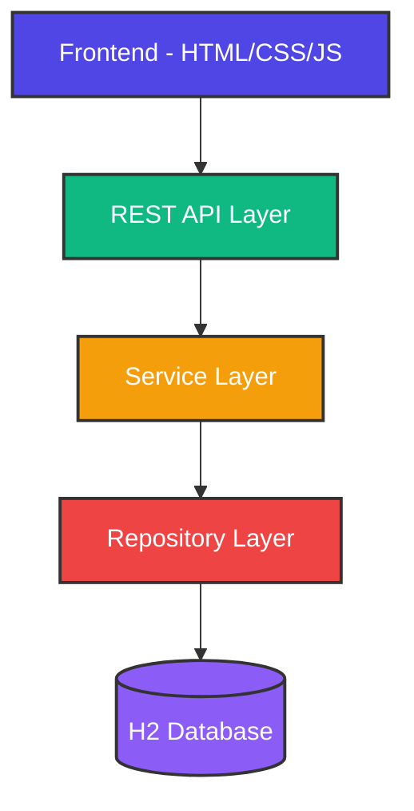

# copilot-app
<div align="center">

# 📝 Task Manager Pro

### A Modern Full-Stack Task Management Application

[](https://spring.io/projects/spring-boot)
[](https://www.oracle.com/java/)
[](LICENSE)
[](https://github.com/features/copilot)
[](http://makeapullrequest.com)

[Features](#-features) • [Demo](#-demo) • [Installation](#-installation) • [Usage](#-usage) • [API](#-api-documentation) • [Contributing](#-contributing)


</div>

---

## 🌟 Overview

**Task Manager Pro** is a feature-rich, full-stack task management application built with **Spring Boot** and powered by **GitHub Copilot**. This project demonstrates modern web development practices, RESTful API design, and seamless frontend-backend integration.

### 🎯 Built With GitHub Copilot

This entire application was developed with the assistance of **GitHub Copilot**, showcasing AI-powered development workflows and best practices.

---

## ✨ Features

<div align="center">

| Feature | Description |
|---------|-------------|
| 📋 **Full CRUD Operations** | Create, Read, Update, and Delete tasks effortlessly |
| 🔍 **Smart Search** | Real-time search functionality to find tasks quickly |
| 🎨 **Modern UI** | Clean, responsive design with smooth animations |
| 📊 **Dashboard Statistics** | Visual overview of task completion status |
| 🏷️ **Task Filtering** | Filter by status: All, Pending, or Completed |
| 💾 **Persistent Storage** | H2 Database with JPA/Hibernate integration |
| 🔄 **Real-time Updates** | Instant UI updates after operations |
| 📱 **Responsive Design** | Works seamlessly on desktop, tablet, and mobile |
| 🎯 **RESTful API** | Well-documented REST endpoints |
| ⚡ **Fast Performance** | Optimized backend with Spring Boot |

</div>

---

## 🎬 Demo & Interface

### 🖥️ Application Interface Preview

```
╔══════════════════════════════════════════════════════════════════════════════╗
║                       📝 TASK MANAGER PRO                                    ║
╚══════════════════════════════════════════════════════════════════════════════╝

┌────────────────┬────────────────┬────────────────┐
│  Total Tasks   │    Pending     │   Completed    │
│      12        │       5        │       7        │
└────────────────┴────────────────┴────────────────┘

╔══════════════════════════════════════════════════════════════════════════════╗
║  Create New Task                                                             ║
╠══════════════════════════════════════════════════════════════════════════════╣
║  Title: [____________________________________]                               ║
║  Description: [________________________________]                             ║
║               [________________________________]                             ║
║  [ Add Task ]                                                                ║
╚══════════════════════════════════════════════════════════════════════════════╝

┌──────────────────────────────────────────────────────────────────────────────┐
│ 🔍 Search: [_____________]  [All] [Pending] [Completed]                     │
└──────────────────────────────────────────────────────────────────────────────┘

╔══════════════════════════════════════════════════════════════════════════════╗
║ ✅ Complete Project Documentation                                           ║
║ Write comprehensive README with all features                                ║
║ [Mark Pending] [Edit] [Delete]                                              ║
╚══════════════════════════════════════════════════════════════════════════════╝

╔══════════════════════════════════════════════════════════════════════════════╗
║ ⏳ Implement User Authentication                                            ║
║ Add JWT-based authentication system                                         ║
║ [Mark Complete] [Edit] [Delete]                                             ║
╚══════════════════════════════════════════════════════════════════════════════╝
```

### 💻 Frontend Code Preview

<details>
<summary><b>🎨 Modern CSS Styling</b></summary>

```css
/* Gradient Header */
header {
    background: linear-gradient(135deg, #667eea 0%, #764ba2 100%);
    color: white;
    padding: 2rem 0;
    box-shadow: 0 4px 6px rgba(0, 0, 0, 0.1);
}

/* Task Card with Hover Effect */
.task-card {
    background: #ffffff;
    border-radius: 12px;
    padding: 1.5rem;
    transition: all 0.3s ease;
    box-shadow: 0 2px 8px rgba(0, 0, 0, 0.1);
}

.task-card:hover {
    transform: translateY(-4px);
    box-shadow: 0 8px 16px rgba(79, 70, 229, 0.2);
}

/* Animated Button */
.btn-primary {
    background: linear-gradient(45deg, #4f46e5, #7c3aed);
    border: none;
    padding: 0.75rem 1.5rem;
    border-radius: 8px;
    cursor: pointer;
    transition: all 0.3s;
}

.btn-primary:hover {
    transform: scale(1.05);
    box-shadow: 0 4px 12px rgba(79, 70, 229, 0.4);
}
```
</details>

<details>
<summary><b>⚡ JavaScript Functionality</b></summary>

```javascript
// Fetch and Display Tasks
async function loadTasks() {
    try {
        const response = await fetch('/api/tasks');
        const tasks = await response.json();
        renderTasks(tasks);
        updateStats(tasks);
    } catch (error) {
        console.error('Error loading tasks:', error);
    }
}

// Create New Task
async function createTask(task) {
    const response = await fetch('/api/tasks', {
        method: 'POST',
        headers: { 'Content-Type': 'application/json' },
        body: JSON.stringify(task)
    });
    if (response.ok) {
        showNotification('Task created successfully! ✅');
        loadTasks();
    }
}

// Toggle Task Status with Animation
async function toggleTaskStatus(id) {
    const task = tasks.find(t => t.id === id);
    task.completed = !task.completed;
    await updateTask(id, task);
    animateTaskCompletion(id);
}
```
</details>

<details>
<summary><b>🏗️ HTML Structure</b></summary>

```html
<!-- Statistics Dashboard -->
<div class="stats">
    <div class="stat-card">
        <div class="stat-number" id="totalTasks">0</div>
        <div class="stat-label">Total Tasks</div>
    </div>
    <div class="stat-card">
        <div class="stat-number" id="pendingTasks">0</div>
        <div class="stat-label">Pending</div>
    </div>
    <div class="stat-card">
        <div class="stat-number" id="completedTasks">0</div>
        <div class="stat-label">Completed</div>
    </div>
</div>

<!-- Task Creation Form -->
<div class="task-form">
    <h2>Create New Task</h2>
    <form id="taskForm">
        <div class="form-group">
            <label for="taskTitle">Title *</label>
            <input type="text" id="taskTitle" required>
        </div>
        <div class="form-group">
            <label for="taskDescription">Description</label>
            <textarea id="taskDescription" rows="3"></textarea>
        </div>
        <button type="submit" class="btn btn-primary">Add Task</button>
    </form>
</div>
```
</details>

### 🎯 Key UI Features

```
┌─────────────────────────────────────────────────────────────┐
│                    INTERACTIVE ELEMENTS                     │
├─────────────────────────────────────────────────────────────┤
│  ✓ Real-time task statistics                               │
│  ✓ Smooth card animations on hover                         │
│  ✓ Instant search with live filtering                      │
│  ✓ One-click task status toggle                            │
│  ✓ Responsive design (mobile, tablet, desktop)             │
│  ✓ Form validation with user feedback                      │
│  ✓ Color-coded task status indicators                      │
│  ✓ Gradient buttons with hover effects                     │
└─────────────────────────────────────────────────────────────┘
```

---

## 🏗️ Architecture

```
┌─────────────────────────────────────────────────────────────────────┐
│                        APPLICATION FLOW                             │
└─────────────────────────────────────────────────────────────────────┘

    User Interface (HTML/CSS/JS)
            │
            ▼
    ┌───────────────────┐
    │   REST API Layer  │  ◄── TaskController
    │  (Spring MVC)     │
    └────────┬──────────┘
             │
             ▼
    ┌───────────────────┐
    │  Service Layer    │  ◄── TaskService
    │ (Business Logic)  │
    └────────┬──────────┘
             │
             ▼
    ┌───────────────────┐
    │ Repository Layer  │  ◄── TaskRepository (JPA)
    │  (Data Access)    │
    └────────┬──────────┘
             │
             ▼
    ┌───────────────────┐
    │   H2 Database     │  ◄── In-Memory Storage
    │   (Persistence)   │
    └───────────────────┘
```

### 📊 Request Flow Example

```
CREATE TASK REQUEST FLOW:
═══════════════════════════════════════════════════════════

1. Frontend (JavaScript)
   └─> POST /api/tasks
       Body: { "title": "New Task", "description": "...", "completed": false }

2. TaskController (@RestController)
   └─> Receives HTTP Request
       └─> Validates @RequestBody
           └─> Calls TaskService.createTask()

3. TaskService (@Service)
   └─> Applies Business Logic
       └─> Calls TaskRepository.save()

4. TaskRepository (JpaRepository)
   └─> Persists to Database
       └─> Returns saved Task entity

5. Response Chain
   └─> Service returns Task
       └─> Controller wraps in ResponseEntity
           └─> JSON serialized back to Frontend
               └─> UI Updates with new Task

HTTP 201 Created
Body: { "id": 1, "title": "New Task", ... }
```



### 🗂️ Project Structure

```
task-manager-pro/
├── 📁 src/
│   ├── 📁 main/
│   │   ├── 📁 java/
│   │   │   └── 📁 com/example/copilotdemo/
│   │   │       ├── 📁 controller/      # REST Controllers
│   │   │       ├── 📁 service/         # Business Logic
│   │   │       ├── 📁 model/           # JPA Entities
│   │   │       ├── 📁 repository/      # Data Access Layer
│   │   │       └── 📁 exception/       # Custom Exceptions
│   │   └── 📁 resources/
│   │       ├── 📁 static/
│   │       │   ├── 📁 css/             # Stylesheets
│   │       │   ├── 📁 js/              # JavaScript Files
│   │       │   └── index.html          # Main UI
│   │       └── application.properties   # Configuration
│   └── 📁 test/                         # Unit & Integration Tests
├── 📄 pom.xml                           # Maven Dependencies
└── 📄 README.md                         # Documentation
```

---

## 🚀 Installation

### Prerequisites

Before you begin, ensure you have the following installed:

- ☕ **Java 17+** - [Download](https://www.oracle.com/java/technologies/downloads/)
- 🔨 **Maven 3.8+** - [Download](https://maven.apache.org/download.cgi)
- 💻 **IntelliJ IDEA** - [Download](https://www.jetbrains.com/idea/download/)
- 🤖 **GitHub Copilot** (Optional) - [Get Copilot](https://github.com/features/copilot)

### 📥 Clone the Repository

```bash
# Clone this repository
git clone https://github.com/yourusername/task-manager-pro.git

# Navigate to the project directory
cd task-manager-pro
```

### 🔧 Configuration

The application comes with default configuration. You can modify `src/main/resources/application.properties`:

```properties
# Server Configuration
server.port=8080

# H2 Database
spring.datasource.url=jdbc:h2:mem:testdb
spring.datasource.username=sa
spring.datasource.password=

# H2 Console (Access at http://localhost:8080/h2-console)
spring.h2.console.enabled=true
```

### 🎯 Build & Run

#### Using Maven

```bash
# Clean and build the project
mvn clean install

# Run the application
mvn spring-boot:run
```

#### Using IntelliJ IDEA

1. Open the project in IntelliJ IDEA
2. Wait for Maven to download dependencies
3. Navigate to `CopilotDemoApplication.java`
4. Click the green ▶️ button or press `Shift + F10`

### 🌐 Access the Application

Once the application starts, you can access:

- **Main Application**: http://localhost:8080
- **H2 Console**: http://localhost:8080/h2-console
- **API Base URL**: http://localhost:8080/api

---

## 📖 Usage

### Creating a Task

1. Navigate to the main page
2. Fill in the task title and description
3. Click **"Add Task"**
4. Your task appears in the list below

### Managing Tasks

- ✅ **Mark Complete**: Click the "Mark Complete" button
- ✏️ **Edit Task**: Click "Edit", modify details, then "Update Task"
- 🗑️ **Delete Task**: Click "Delete" and confirm
- 🔍 **Search**: Type in the search box to filter tasks

### Filtering Tasks

Use the filter buttons to view:
- **All**: Show all tasks
- **Pending**: Show incomplete tasks only
- **Completed**: Show completed tasks only

---

## 📡 API Documentation

### Base URL
```
http://localhost:8080/api
```

### 🔌 API Endpoints Overview

```
╔═══════════════════════════════════════════════════════════════════╗
║                        AVAILABLE ENDPOINTS                        ║
╠═══════════════════════════════════════════════════════════════════╣
║  GET    /api/tasks              → Get all tasks                   ║
║  GET    /api/tasks/{id}         → Get task by ID                  ║
║  POST   /api/tasks              → Create new task                 ║
║  PUT    /api/tasks/{id}         → Update existing task            ║
║  DELETE /api/tasks/{id}         → Delete task                     ║
║  GET    /api/tasks/completed    → Get completed tasks             ║
║  GET    /api/tasks/pending      → Get pending tasks               ║
║  GET    /api/tasks/search       → Search tasks by keyword         ║
╚═══════════════════════════════════════════════════════════════════╝
```

### 📋 Detailed Endpoint Documentation

<details>
<summary><b>📥 GET /api/tasks</b> - Get all tasks</summary>

**Description:** Retrieves all tasks from the database

**Request:**
```http
GET /api/tasks HTTP/1.1
Host: localhost:8080
Accept: application/json
```

**Response:** `200 OK`
```json
[
  {
    "id": 1,
    "title": "Complete project documentation",
    "description": "Write comprehensive README with examples",
    "completed": false,
    "createdAt": "2026-02-01T19:30:00",
    "updatedAt": "2026-02-01T19:30:00"
  },
  {
    "id": 2,
    "title": "Implement authentication",
    "description": "Add JWT-based user authentication",
    "completed": true,
    "createdAt": "2026-02-01T18:00:00",
    "updatedAt": "2026-02-01T20:15:00"
  }
]
```
</details>

<details>
<summary><b>🔍 GET /api/tasks/{id}</b> - Get task by ID</summary>

**Description:** Retrieves a specific task by its unique identifier

**Request:**
```http
GET /api/tasks/1 HTTP/1.1
Host: localhost:8080
Accept: application/json
```

**Response:** `200 OK`
```json
{
  "id": 1,
  "title": "Complete project documentation",
  "description": "Write comprehensive README with examples",
  "completed": false,
  "createdAt": "2026-02-01T19:30:00",
  "updatedAt": "2026-02-01T19:30:00"
}
```

**Error Response:** `404 Not Found`
```json
{
  "timestamp": "2026-02-01T19:30:00",
  "status": 404,
  "error": "Not Found",
  "message": "Task not found with id: 99"
}
```
</details>

<details>
<summary><b>➕ POST /api/tasks</b> - Create new task</summary>

**Description:** Creates a new task in the system

**Request:**
```http
POST /api/tasks HTTP/1.1
Host: localhost:8080
Content-Type: application/json

{
  "title": "Build REST API",
  "description": "Create RESTful endpoints for task management",
  "completed": false
}
```

**Response:** `201 Created`
```json
{
  "id": 3,
  "title": "Build REST API",
  "description": "Create RESTful endpoints for task management",
  "completed": false,
  "createdAt": "2026-02-01T21:00:00",
  "updatedAt": "2026-02-01T21:00:00"
}
```

**Validation Rules:**
- `title` is required (cannot be null or empty)
- `description` is optional
- `completed` defaults to `false` if not provided
</details>

<details>
<summary><b>✏️ PUT /api/tasks/{id}</b> - Update task</summary>

**Description:** Updates an existing task with new information

**Request:**
```http
PUT /api/tasks/1 HTTP/1.1
Host: localhost:8080
Content-Type: application/json

{
  "title": "Complete project documentation - Updated",
  "description": "Write comprehensive README with code examples and diagrams",
  "completed": true
}
```

**Response:** `200 OK`
```json
{
  "id": 1,
  "title": "Complete project documentation - Updated",
  "description": "Write comprehensive README with code examples and diagrams",
  "completed": true,
  "createdAt": "2026-02-01T19:30:00",
  "updatedAt": "2026-02-01T21:15:00"
}
```
</details>

<details>
<summary><b>🗑️ DELETE /api/tasks/{id}</b> - Delete task</summary>

**Description:** Permanently removes a task from the system

**Request:**
```http
DELETE /api/tasks/1 HTTP/1.1
Host: localhost:8080
```

**Response:** `204 No Content`

No response body is returned upon successful deletion.
</details>

<details>
<summary><b>✅ GET /api/tasks/completed</b> - Get completed tasks</summary>

**Description:** Retrieves only tasks marked as completed

**Request:**
```http
GET /api/tasks/completed HTTP/1.1
Host: localhost:8080
Accept: application/json
```

**Response:** `200 OK`
```json
[
  {
    "id": 2,
    "title": "Implement authentication",
    "description": "Add JWT-based user authentication",
    "completed": true,
    "createdAt": "2026-02-01T18:00:00",
    "updatedAt": "2026-02-01T20:15:00"
  }
]
```
</details>

<details>
<summary><b>⏳ GET /api/tasks/pending</b> - Get pending tasks</summary>

**Description:** Retrieves only tasks that are not yet completed

**Request:**
```http
GET /api/tasks/pending HTTP/1.1
Host: localhost:8080
Accept: application/json
```

**Response:** `200 OK`
```json
[
  {
    "id": 1,
    "title": "Complete project documentation",
    "description": "Write comprehensive README",
    "completed": false,
    "createdAt": "2026-02-01T19:30:00",
    "updatedAt": "2026-02-01T19:30:00"
  }
]
```
</details>

<details>
<summary><b>🔎 GET /api/tasks/search</b> - Search tasks</summary>

**Description:** Searches for tasks by keyword in the title (case-insensitive)

**Request:**
```http
GET /api/tasks/search?keyword=documentation HTTP/1.1
Host: localhost:8080
Accept: application/json
```

**Response:** `200 OK`
```json
[
  {
    "id": 1,
    "title": "Complete project documentation",
    "description": "Write comprehensive README",
    "completed": false,
    "createdAt": "2026-02-01T19:30:00",
    "updatedAt": "2026-02-01T19:30:00"
  }
]
```

**Query Parameters:**
- `keyword` (required): Search term to find in task titles
</details>

### 🧪 Testing with cURL

```bash
# Get all tasks
curl -X GET http://localhost:8080/api/tasks

# Get specific task
curl -X GET http://localhost:8080/api/tasks/1

# Create a new task
curl -X POST http://localhost:8080/api/tasks \
  -H "Content-Type: application/json" \
  -d '{
    "title": "Test Task",
    "description": "This is a test task",
    "completed": false
  }'

# Update a task
curl -X PUT http://localhost:8080/api/tasks/1 \
  -H "Content-Type: application/json" \
  -d '{
    "title": "Updated Task",
    "description": "Task has been updated",
    "completed": true
  }'

# Delete a task
curl -X DELETE http://localhost:8080/api/tasks/1

# Get completed tasks
curl -X GET http://localhost:8080/api/tasks/completed

# Get pending tasks
curl -X GET http://localhost:8080/api/tasks/pending

# Search tasks
curl -X GET "http://localhost:8080/api/tasks/search?keyword=documentation"
```

### 📱 Testing with JavaScript (Fetch API)

```javascript
// Get all tasks
fetch('http://localhost:8080/api/tasks')
  .then(response => response.json())
  .then(data => console.log(data));

// Create new task
fetch('http://localhost:8080/api/tasks', {
  method: 'POST',
  headers: { 'Content-Type': 'application/json' },
  body: JSON.stringify({
    title: 'New Task',
    description: 'Task description',
    completed: false
  })
})
  .then(response => response.json())
  .then(data => console.log(data));

// Update task
fetch('http://localhost:8080/api/tasks/1', {
  method: 'PUT',
  headers: { 'Content-Type': 'application/json' },
  body: JSON.stringify({
    title: 'Updated Task',
    description: 'Updated description',
    completed: true
  })
})
  .then(response => response.json())
  .then(data => console.log(data));

// Delete task
fetch('http://localhost:8080/api/tasks/1', {
  method: 'DELETE'
})
  .then(response => console.log('Deleted successfully'));
```

---

## 🛠️ Tech Stack

<div align="center">

### Backend


### Frontend


### Tools & IDE


</div>

---

## 🎨 Features Showcase

### 📊 Dashboard Statistics

Real-time statistics showing your productivity metrics:

```
┌──────────────────────────────────────────────────────────┐
│              TASK STATISTICS DASHBOARD                   │
├──────────────────────────────────────────────────────────┤
│                                                          │
│   ┌──────────┐     ┌──────────┐     ┌──────────┐       │
│   │   12     │     │    5     │     │    7     │       │
│   │  Total   │     │ Pending  │     │Completed │       │
│   └──────────┘     └──────────┘     └──────────┘       │
│                                                          │
│   Progress: ████████████░░░░░░░░ 58% Complete          │
│                                                          │
└──────────────────────────────────────────────────────────┘
```

**Features:**
- ✅ Auto-updates when tasks are created/modified/deleted
- ✅ Visual progress bar showing completion percentage
- ✅ Color-coded statistics cards
- ✅ Smooth counter animations

---

### 🔍 Smart Search & Filter System

Intelligent search with instant results:

```
┌─────────────────────────────────────────────────────────┐
│ 🔍 Search: [docum_______________]                       │
│                                                         │
│ Filters: [All] [◉ Pending] [Completed]                 │
└─────────────────────────────────────────────────────────┘
        ▼
┌─────────────────────────────────────────────────────────┐
│ ⏳ Complete project documentation                       │
│    Write comprehensive README                           │
└─────────────────────────────────────────────────────────┘
┌─────────────────────────────────────────────────────────┐
│ ⏳ Update API documentation                             │
│    Add Swagger specifications                           │
└─────────────────────────────────────────────────────────┘
```

**Capabilities:**
- 🔎 Live search as you type
- 🔎 Case-insensitive matching
- 🔎 Searches through task titles
- 🔎 Instant visual feedback
- 🔎 No page reload required

---

### 🎯 Task Status Management

One-click status updates with visual feedback:

```
BEFORE:                          AFTER:
┌────────────────────────┐      ┌────────────────────────┐
│ ⏳ Implement Feature   │ ───► │ ✅ Implement Feature   │
│ [Mark Complete] [Edit] │      │ [Mark Pending] [Edit]  │
└────────────────────────┘      └────────────────────────┘
                                       │
                                       ▼
                               ┌──────────────┐
                               │ ✨ Animation │
                               │ + Notification│
                               └──────────────┘
```

**Functionality:**
- ⚡ Instant status toggle
- ⚡ Visual strike-through for completed tasks
- ⚡ Status indicator icons (⏳/✅)
- ⚡ Smooth transition animations
- ⚡ Automatic statistics update

---

### ✨ Interactive Task Cards

Hover effects and smooth interactions:

```
NORMAL STATE:
┌──────────────────────────────────────┐
│ ⏳ Build Authentication System       │
│ Add JWT-based user authentication    │
│ [Complete] [Edit] [Delete]           │
└──────────────────────────────────────┘

HOVER STATE (Elevated):
    ┌──────────────────────────────────────┐
    │ ⏳ Build Authentication System       │ ◄── Lifted up
    │ Add JWT-based user authentication    │     with shadow
    │ [Complete] [Edit] [Delete]           │
    └──────────────────────────────────────┘
       ▼
    Shadow effect + Scale animation
```

**Effects:**
- 🎨 Card elevation on hover
- 🎨 Smooth transform animations
- 🎨 Enhanced shadow effects
- 🎨 Button hover states
- 🎨 Color transitions

---

### 📝 Task Creation Form

Clean, intuitive form with validation:

```
┌─────────────────────────────────────────────────────────┐
│  CREATE NEW TASK                                        │
├─────────────────────────────────────────────────────────┤
│                                                         │
│  Title: *                                               │
│  ┌─────────────────────────────────────────────────┐   │
│  │ Enter task title...                             │   │
│  └─────────────────────────────────────────────────┘   │
│                                                         │
│  Description:                                           │
│  ┌─────────────────────────────────────────────────┐   │
│  │ Enter task description (optional)               │   │
│  │                                                 │   │
│  └─────────────────────────────────────────────────┘   │
│                                                         │
│  [ Add Task ]  ◄── Gradient button with hover effect   │
│                                                         │
└─────────────────────────────────────────────────────────┘
```

**Features:**
- 📋 Real-time validation
- 📋 Required field indicators
- 📋 Auto-focus on first field
- 📋 Enter key submission
- 📋 Form reset after submission
- 📋 Success notifications

---

### 🎪 Responsive Design

Adapts beautifully to all screen sizes:

```
DESKTOP (1200px+):
┌─────────────────────────────────────────────────────────┐
│  [Total: 12]  [Pending: 5]  [Completed: 7]             │
│  ┌─────────────┐ ┌─────────────┐ ┌─────────────┐      │
│  │   Task 1    │ │   Task 2    │ │   Task 3    │      │
│  └─────────────┘ └─────────────┘ └─────────────┘      │
└─────────────────────────────────────────────────────────┘

TABLET (768px):
┌────────────────────────────────┐
│  [Total: 12] [Pending: 5]     │
│  [Completed: 7]                │
│  ┌──────────────────────────┐ │
│  │      Task 1              │ │
│  └──────────────────────────┘ │
│  ┌──────────────────────────┐ │
│  │      Task 2              │ │
│  └──────────────────────────┘ │
└────────────────────────────────┘

MOBILE (320px):
┌─────────────────┐
│  [Total: 12]    │
│  [Pending: 5]   │
│  [Complete: 7]  │
│  ┌───────────┐  │
│  │  Task 1   │  │
│  └───────────┘  │
│  ┌───────────┐  │
│  │  Task 2   │  │
│  └───────────┘  │
└─────────────────┘
```

---

### 🎬 Animation Timeline

```
User Action → API Call → Response → UI Update
    │            │          │           │
    ▼            ▼          ▼           ▼
┌────────┐  ┌────────┐  ┌────────┐  ┌────────┐
│ Click  │→ │ Fetch  │→ │Process │→ │Animate │
│ Button │  │  Data  │  │ JSON   │  │ Change │
└────────┘  └────────┘  └────────┘  └────────┘
    ⏱️ 0ms    ⏱️ 50ms    ⏱️ 100ms   ⏱️ 150ms
                                          │
                                          ▼
                                   ┌──────────────┐
                                   │ Show Success │
                                   │ Notification │
                                   └──────────────┘
                                        ⏱️ 300ms
```

---

## 🤝 Contributing

Contributions are what make the open-source community such an amazing place to learn, inspire, and create. Any contributions you make are **greatly appreciated**.

### How to Contribute

1. **Fork the Project**
2. **Create your Feature Branch**
   ```bash
   git checkout -b feature/AmazingFeature
   ```
3. **Commit your Changes**
   ```bash
   git commit -m 'Add some AmazingFeature'
   ```
4. **Push to the Branch**
   ```bash
   git push origin feature/AmazingFeature
   ```
5. **Open a Pull Request**

### Development Guidelines

- Follow Java coding conventions
- Write meaningful commit messages
- Add tests for new features
- Update documentation as needed
- Use GitHub Copilot for productivity

---

## 📝 Future Enhancements

- [ ] User authentication & authorization
- [ ] Task categories and tags
- [ ] Priority levels (High, Medium, Low)
- [ ] Due date tracking
- [ ] Email notifications
- [ ] File attachments
- [ ] Dark mode toggle
- [ ] Export to PDF/Excel
- [ ] Real-time collaboration
- [ ] Mobile app version

---

## 🐛 Known Issues

Currently, there are no known issues. If you discover a bug, please [open an issue](https://github.com/yourusername/task-manager-pro/issues).

---

## 📄 License

This project is licensed under the MIT License - see the [LICENSE](LICENSE) file for details.

---

## 👏 Acknowledgments

- **Spring Boot Team** - For the amazing framework
- **GitHub Copilot** - For AI-powered development assistance
- **JetBrains** - For IntelliJ IDEA
- **Open Source Community** - For inspiration and support

---

## 📞 Contact

<div align="center">

**Your Name** - [@yourtwitter](https://twitter.com/yourtwitter) - your.email@example.com

Project Link: [https://github.com/yourusername/task-manager-pro](https://github.com/yourusername/task-manager-pro)

### Connect With Me

[](https://github.com/yourusername)
[](https://linkedin.com/in/yourusername)
[](https://twitter.com/yourusername)
[](https://yourportfolio.com)

</div>

---

<div align="center">

### ⭐ Star this repository if you found it helpful!


**Made with ❤️ and GitHub Copilot**

</div>
